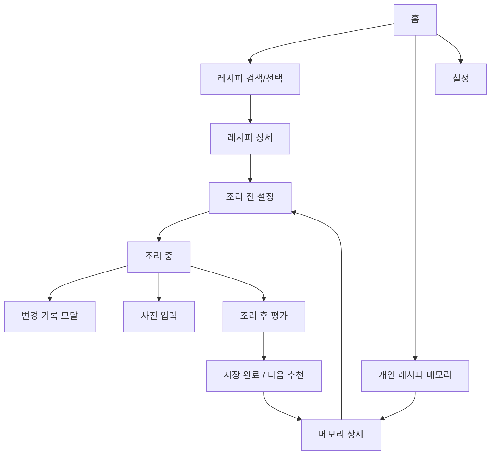
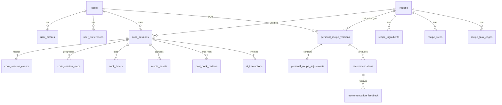

# CookPilot 요구사항·기능 명세·MVP 설계서

작성일: 2026-07-06  
대상 서비스: CookPilot - 요리할수록 내 입맛을 기억하는 실시간 AI 조리 코치

> **2026-07-21 설계 변경 (이 문서보다 우선):** 조리 세션을 서버에 저장하지 않기로 했다.
> 단계 이동·타이머·세션 이벤트는 프론트가 로컬에서 관리하고, 조리가 끝나면 결과(리뷰)만
> 서버로 넘긴다. 따라서 아래 ERD/테이블 목록의 `cook_sessions`, `cook_session_steps`,
> `cook_session_events`, `cook_timers`는 구현 대상이 아니다. 조리 1회의 서버 측 기록은
> `post_cook_reviews`이며, 개인 버전은 `source_review_id`로 그 리뷰를 가리킨다.
> 실제 구현 스키마는 `src/main/resources/db/migration/V1__init_core.sql`, API는 `docs/08_mvp_api.md`.

## 0. 입력 자료와 정리 기준

### 참조 자료

- Notion: [(워크플로우) 와이어프레임 설계](https://app.notion.com/p/395b0ee1a7e980618e40d687cd9ef04b?source=copy_link)
- Figma/FigJam: [CookPilot_Workflow](https://www.figma.com/board/WlaJir1QWnjixFhbuslsdZ/CookPilot_Workflow?node-id=0-1&t=O6an5lAMHQOByPIE-1)
- 로컬 PDF: `기획심의서.pdf`
- 로컬 PDF: `기획심의 종합의견.pdf`
- OpenAI 공식 문서: [Realtime and audio](https://developers.openai.com/api/docs/guides/realtime), [Speech to text](https://developers.openai.com/api/docs/guides/speech-to-text), [Text to speech](https://developers.openai.com/api/docs/guides/text-to-speech), [Function calling](https://developers.openai.com/api/docs/guides/function-calling), [Structured Outputs](https://developers.openai.com/api/docs/guides/structured-outputs)

### 핵심 반영 사항

- CookPilot의 핵심 가치는 "레시피 검색"이 아니라 "조리 전·중·후 데이터를 누적해 다음 조리 버전을 개선하는 개인 레시피 메모리 루프"이다.
- 1차 타깃은 20~39세 1~2인 가구, 자취생, 사회초년생, 신혼부부, 요리 초보자다.
- MVP는 음성 조리 코치, 조리 세션 상태 추적, 개인 레시피 메모리, 개인화 재조리 추천에 집중한다.
- 냉장고 재고 관리, 장보기, 커뮤니티, 챌린지, 크리에이터 기능은 MVP 이후 백로그로 둔다.
- 심의 의견에서 지적된 "Pain Point 구체화", "손이 자유롭지 않은 주방 상황", "단순 레시피 안내와의 차별화", "사용자가 일일이 입력해야 하는 불편 최소화"를 제품 설계의 기준으로 둔다.
- Notion의 코어 코칭 위젯 A/B안은 설문(Track A)과 WoZ 테스트(Track B) 결과 전까지 placeholder로 유지한다.

## 1. 제품 정의

### 한 줄 정의

CookPilot은 초보 요리자가 실제 조리 중 겪는 타이밍, 불 조절, 간 조절, 상태 판단 문제를 음성·텍스트·사진으로 보조하고, 조리 후 결과를 개인 레시피 메모리에 저장해 다음 조리 때 더 나은 "내 버전"을 불러오는 모바일 PWA다.

### 문제 정의

사용자는 레시피와 영상을 참고해도 실제 주방에서는 다음 문제를 겪는다.

- 손에 물·기름이 묻어 화면 조작, 검색, 영상 되감기가 어렵다.
- "지금 다음 단계로 넘어가도 되는지", "불을 줄여야 하는지", "간이 짠데 어떻게 고칠지"를 혼자 판단해야 한다.
- 한 번 실패하거나 수정한 경험이 다음 조리에 자동 반영되지 않는다.
- 기존 레시피 서비스는 조리 전 정보 제공에 강하지만, 조리 중 상태 지원과 조리 후 개인화 누적은 약하다.

### 제품 목표

- 조리 중 화면 조작과 판단 부담을 줄인다.
- 동일 레시피를 반복 조리할수록 사용자의 입맛, 속도, 도구, 실패 원인을 반영한 개인 버전을 만든다.
- 기본 메뉴 10~20개를 대상으로 반복 조리 파일럿을 수행해 개인화 루프의 효과를 검증한다.

### 핵심 사용자 여정


## 2. 요구사항 정리

### 2.1 기능 요구사항

| ID | 요구사항 | 설명 | 우선순위 |
|---|---|---|---|
| FR-01 | 레시피 선택 | 홈에서 최근 사용, 즐겨찾기, 기본 메뉴 검색으로 레시피를 선택한다. | MVP |
| FR-02 | 조리 전 설정 | 인분, 보유 재료, 생략·대체 재료, 도구, 선호 간/매운맛을 설정한다. | MVP |
| FR-03 | 세션 레시피 스냅샷 | 조리 시작 시 현재 인분·재료·대체안·단계 구성을 해당 세션 버전으로 고정한다. | MVP |
| FR-04 | 단계형 조리 진행 | 현재 단계, 예상 시간, 주의사항, 이미지 또는 핵심 시각 단서를 카드 형태로 보여준다. | MVP |
| FR-05 | 로컬 타이머 | 음성 인식이나 네트워크 실패와 무관하게 타이머가 독립 작동한다. | MVP |
| FR-06 | 음성 명령 | "다음", "반복", "타이머 3분", "불 줄일까?", "재료가 없어" 같은 짧은 명령을 처리한다. | MVP |
| FR-07 | 텍스트 fallback | 음성 실패 시 하단 고정 버튼과 짧은 텍스트 입력으로 동일 행동을 수행한다. | MVP |
| FR-08 | 조리 중 변경 기록 | 재료 생략, 대체, 간 조절, 시간 추가, 불 조절, 단계 되돌리기를 이벤트로 저장한다. | MVP |
| FR-09 | 사진 기록 | 조리 전 재료, 조리 중 상태, 완성 사진을 세션에 연결해 저장한다. | MVP-Lite |
| FR-10 | 사진 기반 상태 보조 | 익힘 정도, 색, 농도, 양을 사진으로 확인하고 보수적으로 안내한다. | P1 |
| FR-11 | 조리 후 평가 | 만족도 1~5점, 자유 코멘트, 실패 원인, 다음 수정사항을 입력한다. | MVP |
| FR-12 | 자동 구조화 | 음성·텍스트·사진 메모에서 인분 변경, 생략·대체, 간 조절, 조리 시간 등을 구조화한다. | MVP |
| FR-13 | 개인 레시피 메모리 | 세션 종료 시 사용자별 레시피 버전을 저장하고 상세 화면에서 조회한다. | MVP |
| FR-14 | 다음 조리 추천 | 이전 조리 기록 기반으로 "간장 15% 감소", "감자 생략", "중약불 유지" 같은 추천을 제시한다. | MVP |
| FR-15 | 내 버전 기본 로드 | 같은 레시피를 다시 열면 마지막으로 만족도가 높은 개인 버전을 기본값으로 불러온다. | MVP |
| FR-16 | 안전 가드레일 | 알레르기, 식품안전, 변질 의심, 덜 익은 고기 등 위험 상황에 보수적으로 응답한다. | MVP |
| FR-17 | 사용 로그·지표 | 완료율, 음성 지연, fallback 사용률, 추천 수락률, 재방문율을 측정한다. | MVP |
| FR-18 | 계정·개인정보 | 로그인, 데이터 삭제, 알레르기/식단 목표 관리, 동의 내역을 제공한다. | MVP |

### 2.2 비기능 요구사항

| ID | 요구사항 | 기준 |
|---|---|---|
| NFR-01 | 모바일 우선 | 360px 너비의 모바일 화면에서 한 손 조작이 가능해야 한다. |
| NFR-02 | 주방 UX | 핵심 버튼은 크고, 하단 고정 명령 버튼은 젖은 손·한 손 상황을 고려한다. |
| NFR-03 | 음성 지연 | 음성 명령 후 3초 내 1차 응답을 목표로 한다. 실패 시 즉시 텍스트 fallback을 노출한다. |
| NFR-04 | 타이머 신뢰성 | 앱이 백그라운드로 가거나 AI 응답이 지연되어도 타이머 기준 시각을 서버/로컬에 저장한다. |
| NFR-05 | 안전성 | 식품 변질·알레르기·완전 가열 여부는 단정하지 않고 확인 기준과 보수적 권고를 제공한다. |
| NFR-06 | 개인정보 | 사진, 음성, 알레르기, 입맛 데이터는 최소 수집, 명시 동의, 삭제 기능, 암호화 저장을 적용한다. |
| NFR-07 | 확장성 | 레시피 단계는 태스크 그래프로 저장해 분기, 되돌리기, 타이머, 대체 재료 계산을 확장할 수 있어야 한다. |
| NFR-08 | 관찰 가능성 | AI 호출, 음성 인식 실패, 도구 호출 실패, 추천 수락/거절을 추적한다. |

### 2.3 검증 지표

| 지표 | 목표 |
|---|---|
| 조리 세션 완료율 | 파일럿 사용자 기준 70% 이상 |
| 조리 중 이탈률 | 동일 메뉴 2회차에서 1회차 대비 감소 |
| 음성 명령 성공률 | 짧은 명령어 세트 기준 80% 이상 |
| fallback 사용률 | 사용률 자체보다 실패 원인 분석 지표로 활용 |
| 추천 수락률 | 2회차 이상 조리에서 40% 이상 |
| 재조리 만족도 변화 | 동일 사용자의 동일 메뉴 2회차 만족도 상승 |
| 2주 재방문율 | 개인 메모리 루프의 리텐션 검증 |

## 3. 기능 명세서

### 3.1 홈 / 레시피 선택

| 항목 | 명세 |
|---|---|
| 목적 | 사용자가 빠르게 조리할 메뉴를 선택한다. |
| 주요 요소 | 최근 조리, 즐겨찾기, 기본 메뉴 검색, 개인 버전 배지 |
| 입력 | 검색어, 카테고리, 즐겨찾기 선택 |
| 출력 | 레시피 상세 또는 조리 전 설정 화면 |
| 예외 | 개인 버전이 없으면 기본 레시피로 시작 |
| 수락 기준 | 최근 조리한 레시피가 홈 상단에 노출되고, 같은 레시피는 개인 버전 여부가 표시된다. |

### 3.2 조리 전 설정

| 항목 | 명세 |
|---|---|
| 목적 | "이번에 실행할 버전"을 조리 시작 전에 확정한다. |
| 주요 요소 | 인분 슬라이더, 재료 체크리스트, 생략/대체 선택, 도구/시간/취향 선택, 조리 시작 버튼 |
| 입력 | 인분, 보유 재료, 생략 재료, 대체 재료, 맵기/짠맛 선호, 보유 도구 |
| 출력 | `cook_sessions.setup_snapshot` |
| 예외 | 필수 재료 누락 시 대체안 또는 경고 표시 |
| 수락 기준 | 조리 시작 후 세션 스냅샷이 고정되고, 조리 중 변경은 별도 이벤트로 누적된다. |

### 3.3 조리 중 코칭

| 항목 | 명세 |
|---|---|
| 목적 | 현재 단계 기준으로 다음 행동, 타이머, 상태 판단, 위험 대응을 안내한다. |
| 주요 요소 | 현재 단계 카드, 타이머, 음성 상태, 사진 버튼, 하단 명령 버튼, 재료 변경 버튼 |
| 음성 명령 | 다음, 이전, 반복, 타이머 시작/연장/정지, 도움, 불 조절 질문, 간 조절 질문, 재료 없음 |
| 텍스트 fallback | 다음, 반복, 타이머, 도움, 재료 없음, 기록하기 |
| 상태 머신 | `READY -> COOKING -> PAUSED -> REVIEW -> COMPLETED` |
| 수락 기준 | 음성 명령 실패 시에도 사용자가 화면 하단 버튼만으로 단계 진행과 타이머를 제어할 수 있다. |

### 3.4 코어 위젯 A/B placeholder

| 안 | 방향 | 포함 기능 | 결정 기준 |
|---|---|---|---|
| A안 | 음성·상태체크 중심 | 불세기/타이밍 음성 알림, "지금 얼마나 익었나요?" 질의, 음성 답변 기반 다음 안내 | Track A 설문에서 조리 중 판단/상태 불안 pain이 높고, Track B WoZ에서 음성 부담이 낮을 때 |
| B안 | 재료대체·계산 중심 | 조리 중 재료 없음/바꿈 버튼, 대체 재료·비율 재계산, 양념 배율 고정 위젯 | Track A에서 재료 부족/인분/계산 pain이 높고, Track B에서 음성 입력 부담이 높을 때 |
| 혼합안 | 기본은 A, 상황 버튼은 B | 음성 흐름 유지, 재료 변경은 버튼 기반 | 두 pain이 모두 의미 있고 구현 일정이 허용될 때 |

### 3.5 조리 후 평가

| 항목 | 명세 |
|---|---|
| 목적 | 조리 결과를 개인 레시피 메모리로 전환한다. |
| 주요 요소 | 완성 사진, 만족도 1~5, 짧은 코멘트, 실패 원인, 다음에 바꿀 점 |
| 자동 추출 | 간 조절, 익힘, 소요 시간, 생략/대체, 다음 개선안 |
| 출력 | `post_cook_reviews`, `personal_recipe_versions`, `personal_recipe_adjustments` |
| 수락 기준 | 사용자가 자유 코멘트를 남기면 구조화된 변경사항 초안이 생성되고 사용자가 확인/수정할 수 있다. |

### 3.6 개인 레시피 메모리

| 항목 | 명세 |
|---|---|
| 목적 | 사용자의 반복 조리 이력을 개인화된 레시피 버전으로 저장한다. |
| 목록 | 레시피명, 마지막 조리일, 만족도, 주요 변경사항, 사진 |
| 상세 | 버전 타임라인, 적용된 변경사항, 추천 이유, 원본 레시피 비교 |
| 다음 조리 | 기본값으로 불러오기, 추천 적용/거절/수정 |
| 수락 기준 | 같은 레시피 선택 시 마지막 고만족 버전 또는 사용자가 지정한 기본 버전이 조리 전 설정에 자동 반영된다. |

## 4. MVP 설계

### 4.1 MVP 목표

MVP는 "실제 조리 중 음성으로 세션을 끝까지 진행할 수 있는가"를 1차로 검증하고, 그 과정에서 쌓인 단계 이동, 타이머, 재료 변경, 간 조절, 위험 질문 이벤트가 다음 조리 추천으로 이어지는지를 2차로 검증한다.

따라서 MVP의 중심은 "실시간 음성 조리 세션 + 개인화 기록 루프"이다. 음성 명령은 P1 실험 기능이 아니라 P0 핵심 기능으로 둔다.

### 4.2 MVP 가설

- H1: 조리 중 핵심 명령은 긴 자유 대화보다 짧은 음성 의도 분류와 세션 tool 호출로 처리해야 안정적이다.
- H2: 음성 코칭이 핵심이지만 버튼 fallback이 없으면 실제 주방에서 세션 완료율이 떨어진다.
- H3: 조리 중 변경 이벤트와 조리 후 한 줄 평가만으로도 다음 조리 추천 초안을 만들 수 있다.
- H4: 추천은 전체 과거 평균보다 최근 3회 기록, 명시 선호, 만족도 높은 세션을 더 강하게 반영해야 수락률이 높다.
- H5: 네트워크가 끊겨도 단계 이동과 타이머는 로컬에서 계속 동작해야 조리 신뢰성을 유지할 수 있다.

### 4.3 MVP 범위

#### 포함

- 모바일 PWA
- 이메일 또는 소셜 로그인
- 기본 레시피 10~20개
- 구조화된 레시피 단계/재료/타이머 데이터
- 조리 전 인분·재료·취향 설정
- 조리 중 단계 카드, 로컬 타이머, 실시간 음성 명령, TTS/음성 응답, 텍스트 fallback
- P0 음성 의도 세트: 다음, 이전, 반복, 타이머 생성/연장, 도움, 재료 없음, 간 조절, 위험 질문
- 조리 중 변경 이벤트 기록
- 조리 후 만족도·코멘트 저장
- 개인 레시피 메모리 목록/상세
- 다음 조리 추천 생성 및 적용/거절/수정
- 추천 충돌 해결 로직: 최근 선호, 고만족 세션, 반복 이벤트, 안전 규칙 우선순위 적용
- 세션 실행 방식: 서버 DB 원본 저장, 클라이언트 로컬 상태 병행, 타이머 로컬 우선, 서버 이벤트 동기화
- 식품안전·알레르기 가드레일
- 파일럿 지표 수집

#### 제외

- 냉장고 자동 인식
- 장보기·커머스 연동
- 커뮤니티·공개 공유
- 챌린지·게임화
- 크리에이터 레시피 도구
- 영양 진단, 의료·치료 목적 식단 코칭
- 사진 기반 조리 상태 판별
- 사진만으로 식품 변질 여부를 단정하는 기능

### 4.4 MVP 사용자 스토리

| ID | 사용자 스토리 | 완료 기준 |
|---|---|---|
| US-01 | 초보 요리자로서 최근 조리한 레시피를 다시 선택하고 싶다. | 홈에서 최근 레시피와 개인 버전이 표시된다. |
| US-02 | 자취생으로서 2인분 레시피를 1.5인분으로 바꾸고 싶다. | 재료량과 양념량이 조리 전 설정에 반영된다. |
| US-03 | 조리 중 손을 쓰기 어려운 사용자로서 음성으로 다음 단계를 듣고 싶다. | "다음" 명령으로 단계가 이동하고 TTS 안내가 나온다. |
| US-04 | 음성 인식이 실패한 사용자로서 화면 버튼으로 계속 진행하고 싶다. | 하단 버튼으로 다음/반복/타이머/도움이 가능하다. |
| US-05 | 재료가 없는 사용자로서 조리 중 대체안을 받고 싶다. | 변경 이벤트가 저장되고 대체안 또는 수동 기록이 남는다. |
| US-06 | 조리 후 "짰다"는 평가를 남기고 싶다. | 다음 조리 추천에 간장/소금 감소안이 생성된다. |
| US-07 | 같은 메뉴를 다시 할 때 내 지난 수정사항을 불러오고 싶다. | 개인 레시피 버전이 조리 전 설정 기본값으로 적용된다. |

## 5. 화면 구조

### 5.1 정보 구조



### 5.2 화면 목록

| 화면 ID | 화면명 | 상태 | 핵심 구성 |
|---|---|---|---|
| S-01 | 홈 | MVP | 최근 조리, 즐겨찾기, 검색, 이어하기, 개인 버전 배지 |
| S-02 | 레시피 검색/선택 | MVP | 검색, 카테고리, 난이도, 소요 시간, 기본 메뉴 |
| S-03 | 레시피 상세 | MVP | 재료, 단계 요약, 예상 시간, 내 버전 여부, 시작 CTA |
| S-04 | 조리 전 설정 | MVP | 인분 슬라이더, 재료 체크, 대체/생략, 취향, 도구, 사진 입력 |
| S-05 | 조리 중 | MVP | 단계 카드, 타이머, 음성 상태, 하단 명령 버튼, 사진/도움 |
| S-06 | 변경 기록 모달 | MVP | 재료 없음, 대체, 양념 조절, 시간 추가, 메모 |
| S-07 | 조리 후 평가 | MVP | 완성 사진, 만족도, 코멘트, 자동 추출 확인 |
| S-08 | 저장 완료 | MVP | 저장된 개인 버전 요약, 다음 추천, 홈/메모리 이동 |
| S-09 | 개인 레시피 메모리 목록 | MVP | 레시피별 버전, 마지막 조리일, 만족도, 주요 변경 |
| S-10 | 개인 레시피 메모리 상세 | MVP | 버전 타임라인, 변경 이력, 추천, 다시 조리 |
| S-11 | 설정 | MVP | 프로필, 알레르기, 음성, 개인정보 삭제, 동의 |
| S-12 | 파일럿 관리자 대시보드 | 내부 | 세션 완료율, 음성 실패율, 추천 수락률, 로그 |

### 5.3 조리 중 화면 레이아웃 원칙

- 상단: 레시피명, 현재 단계, 진행률, 일시정지
- 중앙: 큰 단계 카드, 핵심 조리 행동, 이미지/시각 단서
- 보조 영역: 현재 타이머, 다음 타이머, 주의사항
- 하단 고정: `다음`, `반복`, `타이머`, `도움`, `기록` 버튼
- 음성 상태: 듣는 중, 처리 중, 실패, 응답 완료를 작은 상태 표시로 제공
- 위험 안내: 색상과 진동/사운드로 구분하되 공포감을 주지 않는 보수적 문구 사용

### 5.4 주요 상태와 예외 화면

| 상황 | 처리 |
|---|---|
| 마이크 권한 거부 | 텍스트/버튼 모드로 전환하고 설정에서 권한 안내 |
| 음성 인식 실패 | "다시 말하기"와 하단 버튼 유지 |
| 네트워크 지연 | 타이머와 단계 진행은 로컬 유지, AI 답변은 지연 상태 표시 |
| 위험 질문 | "사진만으로 단정할 수 없음" + 확인 기준 + 보수적 조치 |
| 레시피 필수 재료 누락 | 대체 가능/불가 구분, 불가하면 시작 전 경고 |
| 조리 중 앱 이탈 | 돌아오면 진행 중 세션과 타이머 기준 시각 복원 |

## 6. DB 구조

### 6.1 설계 원칙

- 원본 레시피와 사용자 개인 버전을 분리한다.
- 조리 세션은 이벤트 소싱에 가깝게 저장해 "무슨 일이 있었는지"를 추적한다.
- 개인화 추천은 세션 이벤트와 조리 후 평가를 근거로 생성한다.
- 사진·음성 원본은 Object Storage에 저장하고 DB에는 메타데이터와 접근 경로만 둔다.
- 알레르기, 입맛, 사진, 음성 데이터는 민감 정보에 준해 삭제 가능해야 한다.

### 6.2 ERD



### 6.3 주요 테이블

#### 사용자

| 테이블 | 주요 필드 | 설명 |
|---|---|---|
| `users` | `id`, `email`, `provider`, `created_at`, `deleted_at` | 계정 |
| `user_profiles` | `user_id`, `nickname`, `cooking_level`, `household_size`, `default_servings` | 조리 숙련도와 기본값 |
| `user_preferences` | `user_id`, `salty_level`, `spicy_level`, `sweet_level`, `allergies`, `diet_notes`, `tools` | 입맛, 알레르기, 보유 도구 |

#### 원본 레시피

| 테이블 | 주요 필드 | 설명 |
|---|---|---|
| `recipes` | `id`, `title`, `description`, `base_servings`, `difficulty`, `estimated_minutes`, `source_type`, `source_url`, `rights_status`, `status` | 기본 레시피 |
| `recipe_ingredients` | `id`, `recipe_id`, `name`, `amount`, `unit`, `role`, `is_required`, `substitute_group` | 재료와 대체 그룹 |
| `recipe_steps` | `id`, `recipe_id`, `step_no`, `title`, `instruction`, `expected_duration_sec`, `heat_level`, `visual_cues`, `safety_notes` | 조리 단계 |
| `recipe_task_edges` | `id`, `recipe_id`, `from_step_id`, `to_step_id`, `condition` | 분기/되돌리기용 태스크 그래프 |

#### 조리 세션

| 테이블 | 주요 필드 | 설명 |
|---|---|---|
| `cook_sessions` | `id`, `user_id`, `recipe_id`, `personal_version_id`, `status`, `target_servings`, `setup_snapshot`, `started_at`, `ended_at` | 한 번의 조리 |
| `cook_session_steps` | `id`, `session_id`, `recipe_step_id`, `status`, `started_at`, `completed_at`, `actual_duration_sec` | 단계 진행 |
| `cook_session_events` | `id`, `session_id`, `event_type`, `source`, `payload`, `created_at` | 음성/버튼/사진/변경 이벤트 |
| `cook_timers` | `id`, `session_id`, `step_id`, `label`, `duration_sec`, `started_at`, `paused_at`, `completed_at`, `status` | 타이머 |
| `media_assets` | `id`, `user_id`, `session_id`, `capture_stage`, `media_type`, `storage_url`, `metadata`, `created_at` | 사진·오디오 메타데이터 |
| `ai_interactions` | `id`, `session_id`, `model`, `input_type`, `tool_calls`, `latency_ms`, `status`, `created_at` | AI 호출 로그 |

#### 조리 후 메모리

| 테이블 | 주요 필드 | 설명 |
|---|---|---|
| `post_cook_reviews` | `id`, `session_id`, `rating`, `comment_raw`, `parsed_summary`, `failure_reason`, `created_at` | 조리 후 평가 |
| `personal_recipe_versions` | `id`, `user_id`, `recipe_id`, `base_session_id`, `version_no`, `title`, `default_servings`, `summary`, `is_default`, `created_at` | 사용자별 레시피 버전 |
| `personal_recipe_adjustments` | `id`, `version_id`, `adjustment_type`, `target`, `before_value`, `after_value`, `reason`, `confidence`, `source_event_ids` | 변경사항 |
| `recommendations` | `id`, `user_id`, `recipe_id`, `version_id`, `recommendation_type`, `content`, `reason`, `status`, `created_at` | 다음 조리 추천 |
| `recommendation_feedback` | `id`, `recommendation_id`, `action`, `edited_value`, `created_at` | 추천 수락/거절/수정 |

#### RAG와 안전

| 테이블 | 주요 필드 | 설명 |
|---|---|---|
| `knowledge_documents` | `id`, `doc_type`, `title`, `source_url`, `content`, `version`, `created_at` | 식품안전, 조리 기준, 내부 레시피 문서 |
| `knowledge_chunks` | `id`, `document_id`, `chunk_text`, `embedding`, `metadata` | 검색 단위, pgvector 사용 |
| `safety_rules` | `id`, `rule_type`, `trigger`, `response_policy`, `severity`, `enabled` | 알레르기·변질·가열 안전 규칙 |

### 6.4 핵심 JSON 예시

```json
{
  "date": "2026-07-06",
  "recipe": "닭볶음탕",
  "servings": 1.5,
  "changes": ["감자 생략", "간장 15% 감소"],
  "rating": 5,
  "comment": "다음엔 양파도 줄이자",
  "photos": ["pre_cook", "mid_cook", "final"]
}
```

## 7. 기술 스택

### 7.1 권장 스택

| 영역 | 기술 | 이유 |
|---|---|---|
| Frontend | Next.js, React, TypeScript, PWA, Tailwind CSS, shadcn/ui 또는 자체 컴포넌트 | 모바일 웹앱, 빠른 프로토타입, 배포 용이 |
| Client audio | WebRTC 기반 Realtime 연결 또는 브라우저 MediaRecorder | 브라우저/모바일에서 직접 오디오 캡처·재생 |
| Backend API | NestJS 또는 Fastify, TypeScript | 세션 상태 API와 타입 공유에 유리 |
| AI Orchestration | OpenAI Realtime API, Responses/Function calling, Structured Outputs | 음성 코치, 도구 호출, 구조화 추출에 적합 |
| STT | Realtime transcription 또는 bounded audio transcription | 실시간 명령과 조리 후 음성 메모 처리 분리 |
| TTS | Speech generation API | 조리 중 짧고 명확한 안내 음성 생성 |
| Database | PostgreSQL + pgvector | 관계형 데이터, JSONB, 벡터 검색을 한 DB에서 처리 |
| ORM | Prisma 또는 Drizzle | TypeScript 기반 스키마 관리 |
| Object Storage | Supabase Storage, S3, Cloudflare R2 | 사진·오디오 저장 |
| Auth | Auth.js, Supabase Auth, Clerk 중 택1 | MVP 인증 구현 단축 |
| Queue/Worker | BullMQ + Redis 또는 Cloudflare Queues | AI 후처리, 구조화, 추천 생성 비동기화 |
| Deployment | Vercel + managed PostgreSQL, 또는 Docker 기반 Render/Fly.io | 초기 배포와 데모 속도 |
| Observability | Sentry, OpenTelemetry, PostHog | 오류, 지연, 행동 지표 추적 |
| CI/CD | GitHub Actions | 테스트·빌드 자동화 |

### 7.2 AI 모델/음성 구현 선택

OpenAI 공식 문서 기준으로 실시간 음성이 필요한 경우 Realtime 세션이 적합하며, 브라우저/모바일에서 오디오를 직접 캡처·재생하면 WebRTC를 우선 고려한다. 단순 파일 전사나 짧은 음성 메모처럼 실시간성이 낮은 작업은 요청 기반 STT/TTS로 분리한다.

| 용도 | 1차 선택 | 대안 |
|---|---|---|
| 조리 중 저지연 음성 대화 | Realtime API + WebRTC + `gpt-realtime-2` 계열 | WebSocket, 또는 STT + LLM + TTS 파이프라인 |
| 조리 후 음성 코멘트 전사 | `gpt-4o-transcribe` 또는 경량 전사 모델 | 브라우저 SpeechRecognition |
| 짧은 안내 음성 | `gpt-4o-mini-tts` | 브라우저 TTS |
| 구조화 추출 | Structured Outputs + JSON Schema | 서버 규칙 기반 파서 |
| 조리 상태 조작 | Function calling | 서버 API 직접 호출 |

### 7.3 AI 도구 설계

LLM이 직접 DB를 수정하지 않고 서버의 제한된 function tool만 호출하게 한다.

| Tool | 입력 | 역할 |
|---|---|---|
| `get_current_step` | `session_id` | 현재 조리 단계 조회 |
| `advance_step` | `session_id`, `direction` | 다음/이전 단계 이동 |
| `start_timer` | `session_id`, `label`, `duration_sec` | 타이머 시작 |
| `adjust_timer` | `timer_id`, `delta_sec` | 타이머 연장/단축 |
| `record_adjustment` | `session_id`, `type`, `target`, `value`, `reason` | 변경 이벤트 저장 |
| `suggest_substitution` | `recipe_id`, `missing_ingredient`, `constraints` | 대체 재료 제안 |
| `lookup_safety_rule` | `query`, `ingredient`, `context` | 안전 기준 조회 |
| `save_post_review` | `session_id`, `rating`, `comment`, `parsed_changes` | 조리 후 평가 저장 |
| `generate_next_version` | `session_id` | 개인 레시피 버전 생성 |

## 8. 개발 순서

### Phase 0. 검증 정리와 스코프 잠금

- Track A 설문 문항 정리: 조리 중 pain을 불 조절, 간 조절, 익힘 판단, 손질, 재료 부족, 인분 계산으로 분해한다.
- Track B WoZ 테스트 시나리오 정리: 음성만, 버튼 fallback, 사진 보조 흐름의 부담을 비교한다.
- MVP 기본 메뉴 10~20개 선정: 반복 조리에 적합한 메뉴 위주로 고른다.
- 코어 위젯 A/B 선택 기준을 확정한다.

### Phase 1. 데이터 모델과 레시피 태스크 그래프

- PostgreSQL 스키마 생성
- 레시피, 재료, 단계, 타이머, 안전 노트 seed 데이터 작성
- 조리 세션 상태 머신 설계
- 이벤트 타입 enum 정의
- 개인 레시피 버전 생성 규칙 정의

### Phase 2. PWA 기본 화면

- 홈, 검색, 레시피 상세 구현
- 조리 전 설정 화면 구현
- 조리 중 단계 카드와 로컬 타이머 구현
- 조리 후 평가 화면 구현
- 개인 메모리 목록/상세 구현

### Phase 3. 조리 세션 API

- 세션 생성/조회/종료 API
- 단계 이동 API
- 타이머 API
- 이벤트 기록 API
- 사진 업로드 API
- 세션 복원 API

### Phase 4. 음성·AI 코치 1차

- 짧은 명령어 세트 정의
- Realtime 또는 STT 파이프라인 연결
- Function calling으로 세션 상태 조작
- TTS 안내 문장 템플릿 구현
- 음성 실패 시 fallback 이벤트 기록

### Phase 5. 개인 레시피 메모리와 추천

- 조리 후 코멘트 구조화
- 세션 이벤트에서 변경사항 추출
- 개인 레시피 버전 저장
- 다음 조리 추천 생성
- 추천 수락/거절/수정 플로우 구현

### Phase 6. 안전·품질 보강

- 알레르기 hard filter
- 식품안전 RAG 또는 안전 규칙 테이블 적용
- 변질·덜 익음·화재 위험 질문 응답 정책
- 개인정보 동의/삭제
- AI 호출 지연과 실패 처리

### Phase 7. 파일럿 테스트

- 5명 내외 실제 조리 관찰
- 20~30명 인터뷰/설문
- 동일 메뉴 2회 이상 반복 조리 실험
- 조리 완료율, 음성 실패율, 추천 수락률, 만족도 변화 측정
- 결과에 따라 코어 위젯 A/B 또는 혼합안 확정

### Phase 8. 데모와 배포

- 데모용 레시피 3개 완성도 강화
- 데이터 seed와 데모 계정 준비
- 발표 시나리오: 1회차 조리 -> 평가 저장 -> 2회차 개인 버전 로드
- GitHub Actions, Vercel 배포, Sentry/PostHog 연결
- 중간점검 반영 사항 문서화

## 9. 구현 우선순위 백로그

### P0

- 조리 세션 상태 머신
- 단계 카드와 로컬 타이머
- 조리 전 설정 스냅샷
- 조리 후 평가 저장
- 개인 레시피 메모리 버전 생성
- 짧은 명령어 fallback 버튼

### P1

- 실시간 음성 명령
- TTS 안내
- 대체 재료 추천
- 추천 수락/거절/수정
- 사진 업로드와 조리 단계 연결
- 파일럿 지표 대시보드

### P2

- 사진 기반 익힘/농도/색 보조
- 레시피 URL 가져오기
- 냉장고/보유 재료 자동 인식
- 장보기 연동
- 커뮤니티 공유
- 프리미엄 코칭

## 10. 위험요소와 대응

| 위험 | 영향 | 대응 |
|---|---|---|
| Pain Point가 넓게 잡힘 | 제품 차별성 약화 | 설문/인터뷰에서 조리 중 순간을 세분화하고 MVP 핵심 pain을 1~2개로 좁힌다. |
| 음성 인식 실패 | 조리 흐름 중단 | 짧은 명령어, 버튼 fallback, 로컬 타이머, 실패 로그를 기본 제공한다. |
| 사용자가 변경사항 입력을 귀찮아함 | 개인화 메모리 축적 실패 | 조리 중 이벤트와 조리 후 자유 코멘트에서 자동 추출하고, 확인만 하게 만든다. |
| 범용 AI와 차별성 부족 | 사용 이유 약화 | "다음 조리에 내 버전을 불러오는 개인 DB"를 핵심 화면과 데이터 구조로 전면화한다. |
| 사진 판단 안전 리스크 | 신뢰·책임 문제 | 사진은 참고만 하고, 변질·익힘은 단정하지 않으며 보수적 확인 기준을 제공한다. |
| 기능 확장 과다 | 일정 지연 | 냉장고·장보기·커뮤니티·게임화는 MVP 외부 백로그로 고정한다. |
| 저작권/플랫폼 정책 | 사업화 리스크 | 원문 링크 유지, 개인 보관 목적 요약, 공개 공유 제한, 자체 작성 레시피 우선 지원. |

## 11. 다음 의사결정 체크리스트

- Track A 설문 결과에서 가장 큰 pain은 무엇인가: 조리 중 판단, 인분 계산, 재료 대체, 손질, 간 조절 중 택1~2
- Track B WoZ에서 음성 입력 부담은 허용 가능한가
- 코어 위젯은 A안, B안, 혼합안 중 무엇으로 갈 것인가
- 사진 입력은 MVP에서 "저장"까지만 할 것인가, "상태 판단"까지 할 것인가
- 기본 메뉴 10~20개를 어떤 기준으로 고를 것인가
- 개인화 추천의 1차 규칙은 LLM 중심인가, 규칙 기반+LLM 보정인가
- 파일럿에서 2회차 조리를 어떻게 유도할 것인가

## 12. 결론

CookPilot의 MVP는 실시간 음성 코치 앱으로만 보이면 약하다. 차별점은 조리 전 설정, 조리 중 변경, 조리 후 평가가 하나의 세션 데이터로 묶이고, 다음 조리 때 개인 레시피 버전으로 되돌아오는 구조다.

따라서 1차 개발은 화면보다 먼저 데이터 루프를 고정해야 한다. `레시피 -> 세션 -> 이벤트 -> 리뷰 -> 개인 버전 -> 다음 추천` 흐름이 살아 있으면, 음성 위젯 A/B 결과가 뒤늦게 바뀌어도 제품의 중심은 흔들리지 않는다.
